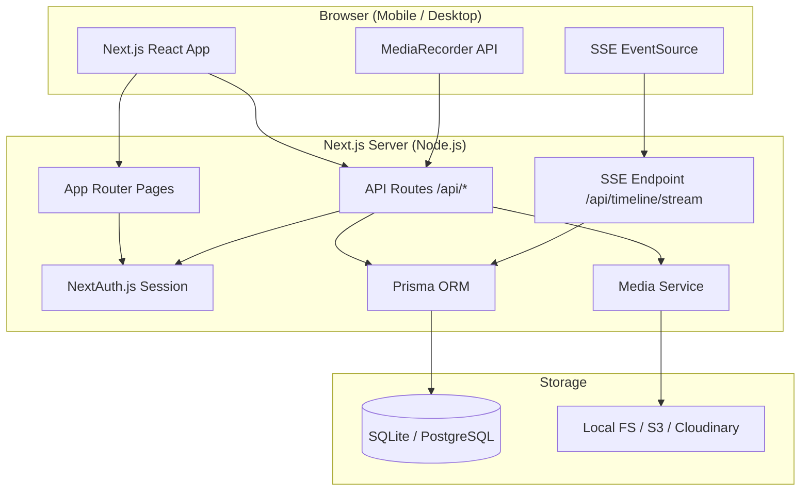
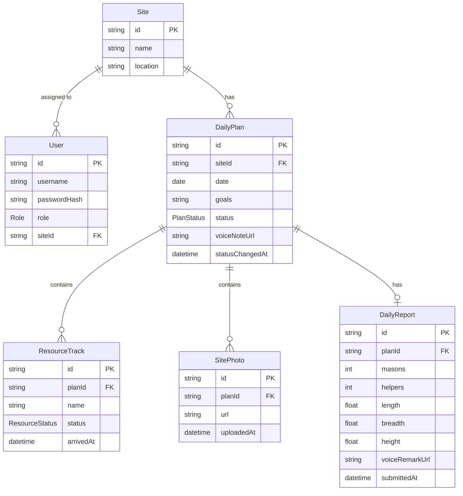

# Design Document — PPT Builders

## Overview

PPT Builders is a mobile-first, full-stack web application for real-time civil construction site management. It supports two roles — Admin and Supervisor — across a daily workflow: the Admin creates a next-day plan with goals, resource lineup, and a voice instruction; the Supervisor executes the plan on-site by marking resource arrivals, uploading progress photos, and submitting an end-of-day Daily Progress Report (DPR). The Admin monitors all activity through a live, auto-refreshing timeline.

### Technology Stack

| Layer | Choice | Rationale |
|---|---|---|
| Framework | Next.js 14 (App Router) | Full-stack React with API routes, server components, and built-in image optimization |
| Styling | Tailwind CSS + Lucide Icons | Utility-first, mobile-first responsive design with consistent iconography |
| ORM | Prisma | Type-safe database access; schema-first migrations; SQLite for dev, PostgreSQL for prod |
| Auth | NextAuth.js (Credentials provider) | Session management, role-based route protection, bcrypt password hashing |
| Media Storage | Local filesystem (dev) / AWS S3 or Cloudinary (prod) | Configurable via environment variables; stable public URLs |
| Real-time | Server-Sent Events (SSE) or polling | Lightweight push for Live Timeline; no WebSocket infrastructure required |
| Voice Recording | HTML5 MediaRecorder API | In-browser audio capture; no native app required |

---

## Architecture

### High-Level Architecture



### Request Flow

1. **Authentication**: Every request passes through NextAuth.js middleware. Unauthenticated requests to protected routes are redirected to `/login`.
2. **Role enforcement**: Middleware reads the session role and blocks cross-role route access (Admin routes reject Supervisor sessions and vice versa).
3. **API routes**: All data mutations go through `/api/*` route handlers. Server-side timestamps are applied here — never trusted from the client.
4. **Media uploads**: Files are streamed to the Media Service, which writes to local disk (dev) or uploads to S3/Cloudinary (prod) and returns a stable URL before the database record is created.
5. **Live Timeline**: The Admin's browser opens a persistent SSE connection to `/api/timeline/stream`. When a Supervisor action (resource arrival, photo upload, DPR submission) is committed to the database, the SSE endpoint pushes the new event to all connected Admin clients.

### Deployment Environments

| Environment | Database | Media Storage | Real-time |
|---|---|---|---|
| Development | SQLite (file) | Local `/public/uploads` | SSE |
| Production | PostgreSQL | AWS S3 or Cloudinary | SSE |

---

## Components and Interfaces

### Page Structure (App Router)

```
app/
├── (auth)/
│   └── login/page.tsx              # Login form
├── (admin)/
│   ├── layout.tsx                  # Admin shell + nav
│   ├── dashboard/page.tsx          # Site list + Live Timeline
│   ├── sites/
│   │   ├── page.tsx                # Site management list
│   │   └── new/page.tsx            # Create site form
│   └── plans/
│       ├── page.tsx                # Plan list
│       └── new/page.tsx            # Plan_Form (create DailyPlan)
└── (supervisor)/
    ├── layout.tsx                  # Supervisor shell + nav
    ├── execution/page.tsx          # Execution_View (morning briefing + check-ins)
    └── dpr/page.tsx                # DPR_Form (end-of-day report)
```

### Component Breakdown

#### Auth Components
- **`LoginForm`** — username/password fields, submit handler, error display. Calls `signIn()` from NextAuth.
- **`AuthGuard`** (middleware) — reads session, enforces role-based redirects.

#### Admin Components
- **`AdminDashboard`** — renders `SiteList` and `LiveTimeline` side by side on desktop, stacked on mobile.
- **`SiteList`** — lists all sites with links to their plans and timeline filter.
- **`SiteForm`** — create/edit a site (name + location fields).
- **`PlanForm`** — multi-section form: site selector, date picker, goals editor (dynamic list), resource lineup builder, `VoiceRecorder`.
- **`GoalEditor`** — add/remove text goal items dynamically.
- **`ResourceLineupBuilder`** — add/remove resource entries (name + quantity).
- **`LiveTimeline`** — SSE-connected feed; renders `TimelineEvent` cards in reverse-chronological order; includes site filter dropdown.
- **`TimelineEvent`** — renders a single event card: timestamp badge, event type icon, site name, optional photo thumbnail.

#### Supervisor Components
- **`ExecutionView`** — morning briefing card (goals + voice player) + `ResourceChecklist` + `PhotoUploader`.
- **`MorningBriefingCard`** — displays plan goals and `AudioPlayer` for Admin voice note.
- **`ResourceChecklist`** — card-based list of resources; each card shows name, status badge, and "Mark Arrived" button (hidden once arrived).
- **`PhotoUploader`** — drag-and-drop / tap-to-select upload area; shows upload progress and previously uploaded photo thumbnails in reverse-chronological order.
- **`DPRForm`** — manpower fields (Masons, Helpers), dimension fields (L, B, H), `VoiceRecorder`, submit button.

#### Shared Components
- **`VoiceRecorder`** — wraps the HTML5 MediaRecorder API. Exposes hold-to-record and tap-to-record modes. Renders a record button, waveform animation during recording, and an `AudioPlayer` preview after recording stops.
- **`AudioPlayer`** — HTML `<audio>` element with custom Tailwind-styled controls.
- **`LoadingSpinner`** — inline spinner shown during file uploads and form submissions.
- **`ErrorBanner`** — dismissible error message component.
- **`ValidationMessage`** — field-level inline validation text.

### API Routes

| Method | Path | Auth | Description |
|---|---|---|---|
| POST | `/api/auth/[...nextauth]` | — | NextAuth handler |
| GET | `/api/sites` | Admin | List all sites |
| POST | `/api/sites` | Admin | Create a site |
| GET | `/api/plans` | Admin/Supervisor | List plans (filtered by role/site) |
| POST | `/api/plans` | Admin | Create a DailyPlan |
| GET | `/api/plans/[id]` | Admin/Supervisor | Get a single plan |
| POST | `/api/resources/[id]/arrive` | Supervisor | Mark resource as arrived |
| POST | `/api/photos` | Supervisor | Upload a site photo |
| POST | `/api/dpr` | Supervisor | Submit a DailyReport |
| GET | `/api/timeline` | Admin | Paginated timeline events |
| GET | `/api/timeline/stream` | Admin | SSE stream for live events |
| POST | `/api/media/upload` | Admin/Supervisor | Upload audio or image file |

---

## Data Models

### Prisma Schema

```prisma
model User {
  id           String   @id @default(cuid())
  username     String   @unique
  passwordHash String
  role         Role
  siteId       String?  // Supervisor is assigned to one site; Admin can be null
  site         Site?    @relation(fields: [siteId], references: [id])
  createdAt    DateTime @default(now())
}

enum Role {
  ADMIN
  SUPERVISOR
}

model Site {
  id          String       @id @default(cuid())
  name        String
  location    String
  createdAt   DateTime     @default(now())
  users       User[]
  dailyPlans  DailyPlan[]
}

model DailyPlan {
  id              String         @id @default(cuid())
  siteId          String
  site            Site           @relation(fields: [siteId], references: [id])
  date            DateTime       @db.Date
  goals           String         // JSON array of goal strings
  status          PlanStatus     @default(PENDING)
  voiceNoteUrl    String?
  createdAt       DateTime       @default(now())
  updatedAt       DateTime       @updatedAt
  statusChangedAt DateTime?
  resources       ResourceTrack[]
  photos          SitePhoto[]
  report          DailyReport?

  @@unique([siteId, date])
}

enum PlanStatus {
  PENDING
  COMPLETED
}

model ResourceTrack {
  id          String          @id @default(cuid())
  planId      String
  plan        DailyPlan       @relation(fields: [planId], references: [id])
  name        String
  status      ResourceStatus  @default(PENDING)
  arrivedAt   DateTime?       // server-side timestamp set on arrival
  createdAt   DateTime        @default(now())
}

enum ResourceStatus {
  PENDING
  ARRIVED
}

model SitePhoto {
  id          String    @id @default(cuid())
  planId      String
  plan        DailyPlan @relation(fields: [planId], references: [id])
  url         String
  uploadedAt  DateTime  @default(now())  // server-side
}

model DailyReport {
  id            String    @id @default(cuid())
  planId        String    @unique
  plan          DailyPlan @relation(fields: [planId], references: [id])
  masons        Int
  helpers       Int
  length        Float
  breadth       Float
  height        Float
  voiceRemarkUrl String?
  submittedAt   DateTime  @default(now())  // server-side
}
```

### Key Design Decisions

- **`goals` as JSON string**: Goals are an ordered list of free-text strings. Storing as a JSON-encoded string avoids a separate `Goal` table while keeping the schema simple. Parsed on read.
- **`@@unique([siteId, date])`** on `DailyPlan`: Enforces the one-plan-per-site-per-day constraint at the database level.
- **`@unique` on `DailyReport.planId`**: Enforces one DPR per plan at the database level.
- **Server-side timestamps**: `arrivedAt`, `uploadedAt`, and `submittedAt` are set by the API route handler using `new Date()` on the server — never accepted from the client payload.
- **`statusChangedAt` on `DailyPlan`**: Records when the plan status last changed for audit trail purposes.
- **`siteId` on `User`**: Supervisors are assigned to exactly one site. Admins have `siteId = null` and can access all sites.

### Entity Relationship Diagram



---

## Media Storage Strategy

### Abstraction Layer

A `MediaService` module abstracts the storage backend behind a single interface:

```typescript
interface MediaService {
  upload(file: Buffer, filename: string, mimeType: string): Promise<string>; // returns stable URL
  delete(url: string): Promise<void>;
}
```

Two implementations are provided:

- **`LocalMediaService`**: Writes files to `/public/uploads/{year}/{month}/` and returns a relative URL (`/uploads/...`). Used when `MEDIA_BACKEND=local`.
- **`S3MediaService`**: Uploads to an S3 bucket using the AWS SDK and returns a pre-signed or public URL. Used when `MEDIA_BACKEND=s3`.
- **`CloudinaryMediaService`**: Uploads via the Cloudinary SDK and returns the Cloudinary delivery URL. Used when `MEDIA_BACKEND=cloudinary`.

The active implementation is selected at startup via the `MEDIA_BACKEND` environment variable.

### File Naming

Files are stored with a collision-resistant name: `{cuid}-{original-filename-slug}.{ext}`. This prevents overwrite collisions and avoids exposing internal IDs.

### Access Control

Media files are served only to authenticated users. In production (S3), pre-signed URLs with a short TTL (e.g., 1 hour) are generated per request. In development, Next.js middleware checks the session before serving files from `/public/uploads`.

### Supported Formats and Limits

| Type | Accepted Formats | Max Size |
|---|---|---|
| Site Photos | JPEG, PNG, WebP | 10 MB |
| Voice Notes / Remarks | WebM, MP4, OGG | 50 MB |

---

## Real-Time Update Mechanism (Live Timeline)

### Approach: Server-Sent Events (SSE)

SSE is chosen over WebSockets because:
- The Live Timeline is **read-only** from the client's perspective (Admin only receives events, never sends them via the stream).
- SSE works over standard HTTP/1.1 and is natively supported by all modern browsers.
- No additional infrastructure (e.g., Redis pub/sub, WebSocket server) is required for the initial deployment.

### SSE Endpoint

`GET /api/timeline/stream` — returns `Content-Type: text/event-stream`.

The endpoint:
1. Authenticates the session (Admin only).
2. Opens a long-lived response stream.
3. Polls the database every 3 seconds for new events since the last sent event ID.
4. Pushes new events as JSON-encoded SSE messages.
5. Sends a heartbeat comment (`: ping`) every 30 seconds to keep the connection alive through proxies.

### Client Integration

The `LiveTimeline` component uses the browser's `EventSource` API:

```typescript
const source = new EventSource('/api/timeline/stream');
source.onmessage = (e) => {
  const event = JSON.parse(e.data);
  setEvents(prev => [event, ...prev]);
};
```

On reconnect (e.g., network drop), `EventSource` automatically retries and sends the `Last-Event-ID` header so the server can resume from the last received event.

### Event Shape

```typescript
type TimelineEvent = {
  id: string;
  type: 'RESOURCE_ARRIVED' | 'PHOTO_UPLOADED' | 'DPR_SUBMITTED';
  siteId: string;
  siteName: string;
  timestamp: string; // ISO 8601
  payload: {
    resourceName?: string;   // for RESOURCE_ARRIVED
    photoUrl?: string;       // for PHOTO_UPLOADED
    thumbnailUrl?: string;   // for PHOTO_UPLOADED
  };
};
```

### Fallback

If SSE is unavailable (e.g., behind a proxy that buffers responses), the `LiveTimeline` component falls back to polling `/api/timeline` every 5 seconds.

---

## Error Handling

### Validation Errors

- **Client-side**: React Hook Form with Zod schemas validates inputs before submission. Field-level `ValidationMessage` components display inline errors immediately.
- **Server-side**: API routes re-validate all inputs with the same Zod schemas. This prevents bypassed client validation from corrupting data.
- **Response format**: Validation errors return HTTP 422 with a JSON body `{ errors: { field: string[] } }`.

### Media Upload Errors

- If the Media Service throws during upload, the API route returns HTTP 500 and does **not** create the database record.
- The client displays an `ErrorBanner` and re-enables the upload control for retry.

### Duplicate Constraint Violations

- Attempting to create a second `DailyPlan` for the same site/date returns HTTP 409 with a descriptive message.
- Attempting to mark a resource as arrived twice returns HTTP 409.
- Attempting to submit a second DPR for the same plan returns HTTP 409.

### Authentication and Authorization Errors

- Unauthenticated requests to protected API routes return HTTP 401.
- Requests from the wrong role return HTTP 403.
- Both cases are handled by a shared `withAuth(role)` middleware wrapper applied to each API route.

### MediaRecorder API Unavailability

- The `VoiceRecorder` component checks `navigator.mediaDevices?.getUserMedia` and `window.MediaRecorder` on mount.
- If unavailable, it renders a warning banner and hides the record button. Forms that include voice notes remain submittable without one.

### Network Errors

- All `fetch` calls are wrapped in try/catch. Network failures surface as `ErrorBanner` messages.
- The SSE `EventSource` handles reconnection automatically. If the connection fails for more than 30 seconds, the UI shows a "Reconnecting…" indicator.

---

## Testing Strategy

### Unit Tests (Jest + React Testing Library)

Focus on specific examples, edge cases, and error conditions:

- **Auth logic**: valid login, invalid credentials, session creation, role enforcement.
- **Validation schemas**: Zod schemas for plan creation, DPR submission, site creation — valid and invalid inputs.
- **`VoiceRecorder` component**: MediaRecorder unavailable warning, record/stop state transitions.
- **`ResourceChecklist`**: "Mark Arrived" button hidden after arrival, timestamp display.
- **`PhotoUploader`**: file type rejection, file size rejection, upload progress display.
- **`LiveTimeline`**: event rendering, site filter, thumbnail display.
- **Media Service**: `LocalMediaService` file write/URL generation, `S3MediaService` upload mock.

### Property-Based Tests (fast-check)

Universal properties verified across many generated inputs (minimum 100 iterations each):

See **Correctness Properties** section below.

### Integration Tests (Playwright or Supertest)

End-to-end flows with a real SQLite test database:

- Full Admin plan creation flow (site → plan → voice note → submit).
- Full Supervisor execution flow (login → view plan → mark arrivals → upload photo → submit DPR).
- Live Timeline event delivery (SSE or polling).
- Duplicate plan/DPR rejection.
- Media upload with format and size validation.

### Test Configuration

- Property tests run with `fast-check` at a minimum of 100 iterations per property.
- Each property test is tagged with a comment: `// Feature: ppt-builders, Property N: <property text>`
- Integration tests use a separate SQLite database seeded before each test run.
- Media uploads in tests use an in-memory `LocalMediaService` mock.

---

## Correctness Properties

*A property is a characteristic or behavior that should hold true across all valid executions of a system — essentially, a formal statement about what the system should do. Properties serve as the bridge between human-readable specifications and machine-verifiable correctness guarantees.*

### Property 1: Valid credentials always produce a role-appropriate session

*For any* user with a valid username, password, and role stored in the system, submitting those credentials to the login endpoint should create an authenticated session and redirect the user to the dashboard corresponding to their role (Admin → `/admin/dashboard`, Supervisor → `/supervisor/execution`).

**Validates: Requirements 1.2**

---

### Property 2: Invalid credentials never produce a session

*For any* username/password pair that does not match a stored user record, the login endpoint should return an authentication error and must not create a session or set an auth cookie.

**Validates: Requirements 1.3**

---

### Property 3: Role-based route access control

*For any* authenticated user with role R, attempting to access a route restricted to role R′ (where R ≠ R′) should result in a 403 response. *For any* unauthenticated request to any protected route, the response should be a redirect to `/login`.

**Validates: Requirements 1.4, 1.5**

---

### Property 4: Passwords are never stored as plaintext

*For any* password string P, the value stored in the database for that user should not equal P, and `bcrypt.compare(P, storedHash)` should return `true`.

**Validates: Requirements 1.7**

---

### Property 5: Site name validation rejects empty and whitespace-only inputs

*For any* site creation request where the name field is empty or composed entirely of whitespace characters, the system should reject the request with a validation error and not persist any Site record.

**Validates: Requirements 2.4**

---

### Property 6: All child records are associated with a valid Site

*For any* DailyPlan, ResourceTrack, SitePhoto, or DailyReport record created through the system, the record's `siteId` (directly or via its parent plan) must reference an existing Site record.

**Validates: Requirements 2.2**

---

### Property 7: Valid plan submissions are saved with correct initial state

*For any* valid plan creation request (with a site, date, at least one goal, and at least one resource), the saved DailyPlan should have status `PENDING`, all submitted goals preserved in the `goals` field, and a non-null `voiceNoteUrl` if a voice note was included.

**Validates: Requirements 3.6**

---

### Property 8: Plan creation rejects missing required fields

*For any* plan creation request that omits `siteId` or `date`, the system should return a validation error and not persist any DailyPlan record.

**Validates: Requirements 3.7**

---

### Property 9: One plan per site per date (uniqueness invariant)

*For any* site S and date D, if a DailyPlan already exists for (S, D), then any subsequent attempt to create another DailyPlan for the same (S, D) should be rejected with a conflict error and the existing plan should remain unchanged.

**Validates: Requirements 3.10**

---

### Property 10: Saved plans are immediately visible to the assigned Supervisor

*For any* DailyPlan saved for site S on date D, a Supervisor assigned to site S querying their execution view for date D should receive that plan in the response.

**Validates: Requirements 3.9**

---

### Property 11: Execution view displays all goals and resources from the plan

*For any* DailyPlan with N goals and M resources, the Supervisor's Execution_View response for that plan should contain all N goal strings and all M resource entries with their correct statuses.

**Validates: Requirements 4.2, 4.3**

---

### Property 12: Resource status display invariant

*For any* resource with status `PENDING`, the "Mark Arrived" button must be present and the arrival timestamp must not be shown. *For any* resource with status `ARRIVED`, the "Mark Arrived" button must not be present and the `arrivedAt` timestamp must be displayed.

**Validates: Requirements 5.1, 5.3**

---

### Property 13: Resource arrival sets server-side timestamp and prevents re-arrival

*For any* resource in `PENDING` status, after a mark-arrived request, its status should be `ARRIVED` and `arrivedAt` should be a non-null timestamp set by the server (not derived from any client-provided value). *For any* resource already in `ARRIVED` status, a subsequent mark-arrived request should be rejected with a conflict error and the record should remain unchanged.

**Validates: Requirements 5.2, 5.5**

---

### Property 14: Photo upload creates a record with server-side timestamp and stable URL

*For any* valid image file (JPEG, PNG, or WebP, ≤ 10 MB) uploaded by a Supervisor, the system should create a SitePhoto record with a non-null `url` and an `uploadedAt` timestamp set by the server, not derived from any client-provided value.

**Validates: Requirements 6.2, 11.2**

---

### Property 15: Photo file format and size validation

*For any* file with a MIME type in `{image/jpeg, image/png, image/webp}` and size ≤ 10 MB, the upload should succeed. *For any* file with a MIME type not in that set, or with size > 10 MB, the upload should be rejected and no SitePhoto record should be created.

**Validates: Requirements 6.4, 6.5, 6.6**

---

### Property 16: Uploaded photos are displayed in reverse chronological order

*For any* set of N SitePhoto records associated with a DailyPlan, each with a distinct `uploadedAt` timestamp, the Execution_View should display them ordered from most recent to oldest.

**Validates: Requirements 6.7**

---

### Property 17: DPR numeric field validation

*For any* DPR submission where `masons` or `helpers` is a negative integer, or where `length`, `breadth`, or `height` is a non-numeric value, the system should reject the submission with a validation error and not persist any DailyReport record.

**Validates: Requirements 7.1, 7.2, 7.6**

---

### Property 18: DPR submission links report to plan and marks plan completed

*For any* valid DPR submission for DailyPlan P, the saved DailyReport should have `planId = P`, and the DailyPlan P should have its status updated to `COMPLETED` with `statusChangedAt` set to the server-side submission time.

**Validates: Requirements 7.4, 7.5, 11.5**

---

### Property 19: One DPR per plan (uniqueness invariant)

*For any* DailyPlan P that already has a DailyReport, any subsequent DPR submission for P should be rejected with a conflict error and the existing report should remain unchanged.

**Validates: Requirements 7.8**

---

### Property 20: Timeline events are displayed in reverse chronological order with required fields

*For any* set of timeline events with distinct timestamps, the Live_Timeline should display them ordered from most recent to oldest. *For any* individual timeline event, its rendered card must contain the event timestamp, a label identifying the event type, and the associated site name. *For any* `PHOTO_UPLOADED` event, the rendered card must also include a thumbnail image element.

**Validates: Requirements 8.1, 8.3, 8.5**

---

### Property 21: Timeline site filter shows only matching events

*For any* site filter S applied to the Live_Timeline, every event displayed should have `siteId = S`. Events from other sites should not appear.

**Validates: Requirements 8.6**

---

### Property 22: Media Service returns a stable URL for every upload

*For any* file successfully uploaded through the Media Service, the returned URL should be non-null, non-empty, and consistently reference the same file on subsequent retrieval.

**Validates: Requirements 9.2**

---

### Property 23: Storage failure prevents database record creation

*For any* upload request where the storage backend throws an error, no SitePhoto record and no voice note URL should be persisted in the database.

**Validates: Requirements 9.4**

---

### Property 24: Media access control enforces site membership

*For any* media file associated with site S, a request from an unauthenticated user or from an authenticated user without access to site S should be denied (HTTP 401 or 403).

**Validates: Requirements 9.5**

---

### Property 25: Data retention — no user-facing deletion

*For any* DailyPlan, ResourceTrack, SitePhoto, or DailyReport record created through the system, no user-facing API endpoint should result in the deletion of that record. All such records must remain retrievable after creation.

**Validates: Requirements 11.4**
